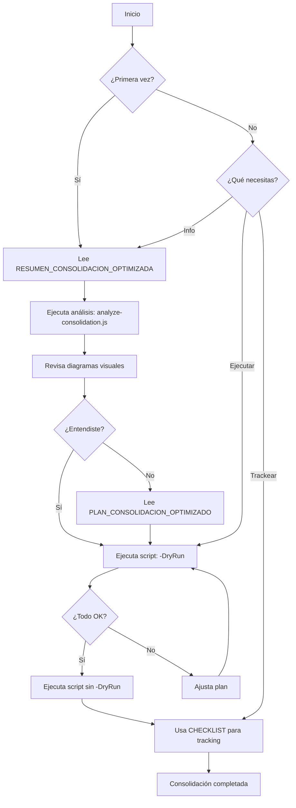

# 📚 ÍNDICE MAESTRO: CONSOLIDACIÓN OPTIMIZADA

**Proyecto**: Consolidación Sub-Son1k-2.3 → ALFASSV  
**Fecha**: 2026-01-06  
**Estrategia**: 16 apps → 8 apps robustas (50% reducción)

---

## 🎯 DOCUMENTOS PRINCIPALES

### **1. INICIO RÁPIDO** ⭐
📄 **[RESUMEN_CONSOLIDACION_OPTIMIZADA.md](./RESUMEN_CONSOLIDACION_OPTIMIZADA.md)**
- ✅ **EMPIEZA AQUÍ** - Resumen ejecutivo completo
- ✅ Comandos listos para ejecutar
- ✅ Checklist rápido
- ✅ Métricas y beneficios
- ⏱️ Lectura: 10 minutos

**Cuándo usar**: Quieres empezar YA y tener vista general

---

### **2. PLAN DETALLADO** 📋
📄 **[PLAN_CONSOLIDACION_OPTIMIZADO.md](./PLAN_CONSOLIDACION_OPTIMIZADO.md)**
- ✅ Arquitectura completa antes/después
- ✅ Plan día por día (7 días)
- ✅ Código de ejemplo para cada consolidación
- ✅ Estructura de carpetas detallada
- ⏱️ Lectura: 30 minutos

**Cuándo usar**: Necesitas entender la arquitectura completa

---

### **3. CHECKLIST INTERACTIVO** ☑️
📄 **[CHECKLIST_CONSOLIDACION.md](./CHECKLIST_CONSOLIDACION.md)**
- ✅ Tracking paso a paso
- ✅ Espacios para notas
- ✅ Campos para llenar
- ✅ Casos de prueba
- ⏱️ Uso: Durante toda la consolidación

**Cuándo usar**: Para trackear progreso durante la ejecución

---

## 🛠️ HERRAMIENTAS

### **4. SCRIPT AUTOMATIZADO** 🤖
📄 **[scripts/consolidate-optimized.ps1](./scripts/consolidate-optimized.ps1)**
- ✅ Automatiza toda la consolidación
- ✅ Modo dry-run disponible
- ✅ Ejecución paso por paso
- ✅ Manejo de errores
- 🎮 **Ejecución**: `.\scripts\consolidate-optimized.ps1 -Step all`

**Cuándo usar**: Para automatizar la migración

---

### **5. ANÁLISIS COMPARATIVO** 📊
📄 **[scripts/analyze-consolidation.js](./scripts/analyze-consolidation.js)**
- ✅ Compara estructuras de ambos proyectos
- ✅ Identifica apps únicas
- ✅ Compara dependencias
- ✅ Genera recomendaciones
- 🎮 **Ejecución**: `node scripts/analyze-consolidation.js`

**Cuándo usar**: Para análisis inicial antes de empezar

---

## 📖 DOCUMENTACIÓN DE REFERENCIA

### **6. PLAN ORIGINAL** (Para referencia)
📄 **[PLAN_CONSOLIDACION_DEFINITIVO.md](./PLAN_CONSOLIDACION_DEFINITIVO.md)**
- ⚠️ Plan anterior (16 apps separadas)
- ✅ Útil para comparación
- ❌ NO usar este plan - Usar el optimizado

**Cuándo usar**: Solo para referencia histórica

---

### **7. RESUMEN EJECUTIVO ORIGINAL** (Para referencia)
📄 **[RESUMEN_EJECUTIVO_CONSOLIDACION.md](./RESUMEN_EJECUTIVO_CONSOLIDACION.md)**
- ⚠️ Resumen del plan anterior
- ✅ Análisis automático incluido
- ❌ NO usar este plan - Usar el optimizado

**Cuándo usar**: Solo para referencia histórica

---

## 🖼️ RECURSOS VISUALES

### **8. Diagrama de Consolidación**
🖼️ **consolidation_plan_diagram.png**
- Muestra migración de apps específicas
- Útil para entender flujo

### **9. Diagrama de Arquitectura Optimizada** ⭐
🖼️ **optimized_architecture.png**
- Muestra ANTES (16 apps) vs DESPUÉS (8 apps)
- Vista clara de la consolidación
- **Usa esta para presentaciones**

---

## 🚀 GUÍA DE USO RECOMENDADA

### **Para Empezar Rápido** (15 minutos)
```
1. Lee RESUMEN_CONSOLIDACION_OPTIMIZADA.md (10 min)
2. Ejecuta el script automatizado (5 min):
   .\scripts\consolidate-optimized.ps1 -Step all -DryRun
3. Revisa los cambios propuestos
4. Si todo está OK, ejecuta sin -DryRun
```

### **Para Entender Profundamente** (1 hora)
```
1. Lee RESUMEN_CONSOLIDACION_OPTIMIZADA.md (10 min)
2. Lee PLAN_CONSOLIDACION_OPTIMIZADO.md (30 min)
3. Ejecuta análisis comparativo (5 min):
   node scripts/analyze-consolidation.js
4. Revisa diagramas (5 min)
5. Abre CHECKLIST_CONSOLIDACION.md (10 min)
6. Empieza la consolidación paso a paso
```

### **Para Ejecución Manual** (7 días)
```
Día 1: Setup
  - Lee PLAN_CONSOLIDACION_OPTIMIZADO.md
  - Abre CHECKLIST_CONSOLIDACION.md
  - Ejecuta Step 1 del script O hazlo manual

Día 2-3: Ghost Studio Pro
  - Sigue el plan detallado
  - Marca checkboxes en checklist
  - Ejecuta Step 2 del script O hazlo manual

Día 4-7: Resto de consolidación
  - Sigue el plan
  - Usa checklist para tracking
  - Ejecuta scripts por paso
```

---

## 📂 ESTRUCTURA DE ARCHIVOS

```
Sub-Son1k-2.3/
├── ÍNDICE_MAESTRO.md                          ← ESTÁS AQUÍ
├── RESUMEN_CONSOLIDACION_OPTIMIZADA.md        ← INICIO RÁPIDO ⭐
├── PLAN_CONSOLIDACION_OPTIMIZADO.md           ← PLAN DETALLADO
├── CHECKLIST_CONSOLIDACION.md                 ← TRACKING
├── scripts/
│   ├── consolidate-optimized.ps1              ← AUTOMATIZACIÓN ⭐
│   └── analyze-consolidation.js               ← ANÁLISIS
├── PLAN_CONSOLIDACION_DEFINITIVO.md           ← Referencia (plan anterior)
└── RESUMEN_EJECUTIVO_CONSOLIDACION.md         ← Referencia (plan anterior)
```

---

## 🎯 DECISIÓN RÁPIDA: ¿QUÉ DOCUMENTO LEER?

### ❓ **"Quiero empezar YA"**
→ **RESUMEN_CONSOLIDACION_OPTIMIZADA.md** + ejecutar script

### ❓ **"Necesito entender la arquitectura completa"**
→ **PLAN_CONSOLIDACION_OPTIMIZADO.md**

### ❓ **"Quiero ver qué va a cambiar"**
→ Ejecutar `.\scripts\consolidate-optimized.ps1 -DryRun`

### ❓ **"Necesito trackear mi progreso"**
→ **CHECKLIST_CONSOLIDACION.md**

### ❓ **"Quiero comparar ambos proyectos"**
→ Ejecutar `node scripts/analyze-consolidation.js`

### ❓ **"¿Por qué consolidamos en lugar de migrar todo?"**
→ Lee sección "ANTES vs DESPUÉS" en PLAN_CONSOLIDACION_OPTIMIZADO.md

---

## 🔄 FLUJO DE TRABAJO RECOMENDADO



---

## 📊 MÉTRICAS DEL PROYECTO

### Tamaño de la Consolidación
- **Apps origen**: 16
- **Apps destino**: 8
- **Reducción**: 50%
- **Tiempo estimado**: 7 días
- **Complejidad**: Media

### Archivos de Documentación
- **Guías principales**: 3
- **Scripts**: 2
- **Diagramas**: 2
- **Referencias**: 2

### Esfuerzo Estimado
- **Lectura inicial**: 40 min
- **Setup**: 1 día
- **Consolidación**: 5 días
- **Testing + Deploy**: 1 día
- **Total**: 7 días

---

## ✅ CHECKLIST PRE-INICIO

Antes de empezar, verifica:

- [ ] Has leído **RESUMEN_CONSOLIDACION_OPTIMIZADA.md**
- [ ] Entiendes la estrategia de consolidación (menos apps, más features)
- [ ] Tienes acceso a ambos proyectos:
  - [ ] Sub-Son1k-2.3 en `c:/Users/qrrom/Downloads/Sub-Son1k-2.3/`
  - [ ] ALFASSV-base en `c:/Users/qrrom/Downloads/ALFASSV-base/`
- [ ] Herramientas instaladas:
  - [ ] Node.js 18+
  - [ ] pnpm
  - [ ] Git
- [ ] Has ejecutado el análisis: `node scripts/analyze-consolidation.js`
- [ ] Has revisado los diagramas visuales
- [ ] Tienes ~7 días disponibles
- [ ] Has hecho backup de ALFASSV

---

## 🎯 OBJETIVOS CLAROS

Al finalizar la consolidación tendrás:

### ✅ 8 Apps Robustas
1. The Generator (con polling robusto)
2. Web Classic Hub (Dashboard + Music + Image + Video)
3. Ghost Studio Pro (Mini + Pro + Clone)
4. Nova Post Pilot (Social + Community)
5. Live Collaboration
6. Nexus Visual
7. Admin Panel
8. Pixel AI

### ✅ 50% Menos Complejidad
- Menos builds
- Menos deploys
- Menos mantenimiento
- Código compartido

### ✅ UX Mejorada
- Switching rápido entre features
- Todo en un solo lugar
- Experiencia cohesiva

---

## 🚀 COMANDO PARA EMPEZAR

```powershell
# 1. Ve a la carpeta del proyecto
cd c:\Users\qrrom\Downloads\Sub-Son1k-2.3\Sub-Son1k-2.3

# 2. Ejecuta dry run para ver qué haría
.\scripts\consolidate-optimized.ps1 -Step all -DryRun

# 3. Si todo se ve bien, ejecuta de verdad
.\scripts\consolidate-optimized.ps1 -Step all

# 4. O hazlo paso por paso:
.\scripts\consolidate-optimized.ps1 -Step 1  # Setup
.\scripts\consolidate-optimized.ps1 -Step 2  # Ghost Studio Pro
# etc...
```

---

## 📞 AYUDA Y SOPORTE

### Problemas Comunes

**Q: ¿Por qué consolidar en lugar de migrar todas las apps?**
A: Menos complejidad, mejor UX, código compartido. Ver sección "ANTES vs DESPUÉS" en el plan optimizado.

**Q: ¿Puedo ejecutar paso por paso?**
A: Sí, usa `-Step 1`, `-Step 2`, etc.

**Q: ¿Cómo veo qué haría el script sin ejecutarlo?**
A: Usa `-DryRun` flag.

**Q: ¿Puedo personalizar la consolidación?**
A: Sí, edita el script o hazlo manualmente siguiendo el plan.

**Q: ¿Qué pasa con las apps que no se consolidan?**
A: Apps como Nexus Visual, Admin Panel y Pixel AI se mantienen independientes porque tienen propósitos únicos.

---

## 📚 GLOSARIO

- **Consolidación**: Combinar múltiples apps en una sola con múltiples modos/features
- **Modo**: Vista o funcionalidad dentro de una app (ej: Mini DAW, Pro DAW)
- **Tab**: Pestaña de navegación para cambiar entre features
- **Feature**: Funcionalidad específica (ej: Image Creator, Generator Express)
- **Hub**: App central que conecta con otras (Web Classic)
- **DryRun**: Ejecutar script sin hacer cambios reales, solo mostrar qué haría

---

## 🎉 ¡LISTO PARA EMPEZAR!

Tienes todo lo necesario para una consolidación exitosa:

✅ Documentación completa  
✅ Scripts automatizados  
✅ Diagramas visuales  
✅ Checklist de tracking  
✅ Plan detallado día por día

**Siguiente paso**: Lee [RESUMEN_CONSOLIDACION_OPTIMIZADA.md](./RESUMEN_CONSOLIDACION_OPTIMIZADA.md) y ejecuta el script 🚀

---

**Última actualización**: 2026-01-06  
**Versión**: 1.0 - Consolidación Optimizada
